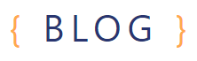
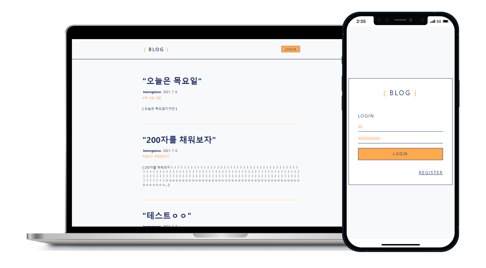

<br>
<div align="center"></div>



**[Features]**

```
- 회원가입 및 로그인, 로그아웃
- 포스트 작성, 수정 및 삭제 기능
- 블로그 포스트 목록 및 포스트를 읽는 기능
- 페이지네이션 구현
```

**[Technology]**

```
FRONT-END
- JavaScript
- React.js
- Redux, Redux-saga
- Axios
- Styled-component

BACK-END
- Node.js
- Koa
- MongoDB
- JWT (JSON Web Token)
- bcrypt
```

### > 회원가입 및 로그인

### > 포스트 작성

### > 포스트 수정 및 삭제

### > 페이지네이션

**[Project structure]**

```
FRONT-END
.
├─ README.md
├─ jsconfig.json
├─ package.json
├─ public
│  ├─ favicon.ico
│  ├─ index.html
│  └─ ...
├─ src
│  ├─ components                     UI
│  │  ├─ auth
│  │  │  ├─ AuthForm.js
│  │  │  └─ AuthTemplate.js
│  │  ├─ base
│  │  │  └─ Header.js
│  │  ├─ common
│  │  │  ├─ AskModal.js
│  │  │  ├─ Button.js
│  │  │  ├─ Header.js
│  │  │  ├─ Responsive.js
│  │  │  ├─ SubInfo.js
│  │  │  └─ Tags.js
│  │  ├─ post
│  │  │  ├─ AskRemoveModal.js
│  │  │  ├─ PostActionButtons.js
│  │  │  └─ PostViewer.js
│  │  ├─ posts
│  │  │  ├─ PostList.js
│  │  │  └─ pagination.js
│  │  └─ write
│  │     ├─ Editor.js
│  │     ├─ TagBox.js
│  │     └─ WriteActionButtons.js
│  ├─ containers                     컨테이너 컴포넌트
│  │  ├─ auth
│  │  │  ├─ LoginForm.js
│  │  │  └─ RegisterForm.js
│  │  ├─ common
│  │  │  └─ HeaderContainer.js
│  │  ├─ post
│  │  │  └─ PostViewerContainer.js
│  │  ├─ posts
│  │  │  ├─ PaginationContainer.js
│  │  │  └─ PostListContainer.js
│  │  └─ write
│  │     ├─ EditorContainer.js
│  │     ├─ TagBoxContainer.js
│  │     └─ WriteActionButtonsContainer.js
│  ├─ lib
│  │  ├─ api
│  │  │  ├─ auth.js
│  │  │  ├─ client.js                aixos
│  │  │  └─ posts.js
│  │  ├─ createRequestSaga.js        리덕스사가
│  │  └─ styles
│  │     └─ palette.js
│  ├─ modules                        리덕스 모듈
│  │  ├─ auth.js
│  │  ├─ index.js
│  │  ├─ loading.js
│  │  ├─ post.js
│  │  ├─ posts.js
│  │  ├─ user.js
│  │  └─ write.js
│  ├─ pages                          라우트 컴포넌트
│  │   ├─ LoginPage.js
│  │   ├─ PostListPage.js
│  │   ├─ PostPage.js
│  │   ├─ RegisterPage.js
│  │   └─ WritePage.js
│  ├─ App.css
│  ├─ App.js
│  ├─ App.test.js
│  ├─ index.css
│  ├─ index.js
│  ├─ logo.svg
│  ├─ reportWebVitals.js
│  └─ setupTests.js
│


BACK-END
.
├─ jsconfig.json
├─ package.json
├─ src
│  ├─ api
│  │  ├─ auth                     auth API
│  │  │  ├─ auth.ctrl.js
│  │  │  └─ index.js
│  │  ├─ index.js                 라우트 모듈화
│  │  └─ posts                    posts API
│  │     ├─ index.js
│  │     └─ posts.ctrl.js
│  ├─ createFakeData.js
│  ├─ lib                         JWT
│  │  ├─ checkLoggedIn.js
│  │  └─ jwtMiddleware.js
│  ├─ index.js                    ES Module
│  ├─ main.js                     Koa/mongoose/route
│  └─ models                      User, Post 스키마/모델
│     ├─ post.js
│     └─ user.js
│
```

**[Dependencies]**

```
FRONT-END

"dependencies": {
    "@testing-library/jest-dom": "^5.11.4",
    "@testing-library/react": "^11.1.0",
    "@testing-library/user-event": "^12.1.10",
    "axios": "^0.21.1",
    "immer": "^9.0.3",
    "qs": "^6.10.1",
    "quill": "^1.3.7",
    "react": "^17.0.2",
    "react-dom": "^17.0.2",
    "react-helmet-async": "^1.0.9",
    "react-redux": "^7.2.4",
    "react-router-dom": "^5.2.0",
    "react-scripts": "4.0.3",
    "redux": "^4.1.0",
    "redux-actions": "^2.6.5",
    "redux-devtools-extension": "^2.13.9",
    "redux-saga": "^1.1.3",
    "styled-components": "^5.3.0",
    "web-vitals": "^1.0.1"
  },
  "proxy": "http://localhost:4000/"


BACK-END

"dependencies": {
    "bcrypt": "^5.0.1",
    "dotenv": "^10.0.0",
    "eslint-config-prettier": "^8.3.0",
    "esm": "^3.2.25",
    "joi": "^17.4.0",
    "jsonwebtoken": "^8.5.1",
    "koa": "^2.13.1",
    "koa-bodyparser": "^4.3.0",
    "koa-router": "^10.0.0",
    "koa-static": "^5.0.0",
    "mongoose": "^5.13.0",
    "sanitize-html": "^2.4.0"
  },
  "devDependencies": {
    "eslint": "^7.29.0",
    "nodemon": "^2.0.9"
  },
```

**[Reference]**

```
리액트를 다루는 기술
```
